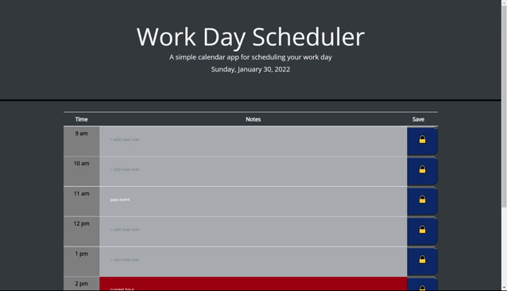

# 05-hw-work-day-scheduler

## My Task

<br>

 To create a calendar application that allows any user to save notes for each hour of the day which would run using HTML, CSS, jQuery, and the Moment.js library.

<br>

## User Story

<br>

AS A chosen developer

I WANT to create a calendar application for users to add events to their daily planner

SO THAT employees can use my application as a resource to manage their time effectively

<br>

## Employer User Story

<br>

```md

AS AN employee with a busy schedule
I WANT to add important events to a daily planner
SO THAT I can manage my time effectively

```

<br>

## Application

<br>
The following animation demonstrates the application's functionality

<br><br>



<br><br>

## What I Accomplished

<br>

* Page loads to the planner where the current day, month, and year is diplayed in the heading
<br>

* When the user scrolls down the user is presented with time block sections for standard business hours. 
<br>

* Created time block hours on the left, a section for entering new notes in the center, and the save button to submit the new entry on the right
<br>

* Created color coded time blocks for the user to determine if it is in the past, present, or future
<br>

* When a user clicks into a time block they are able to enter notes for that day
<br>

* When a user clicks the save button an alert confirms the submission of the new entry 
<br>

* When a user refreshes the page the time block is still saved into the time block

<br><br>


## External Links

